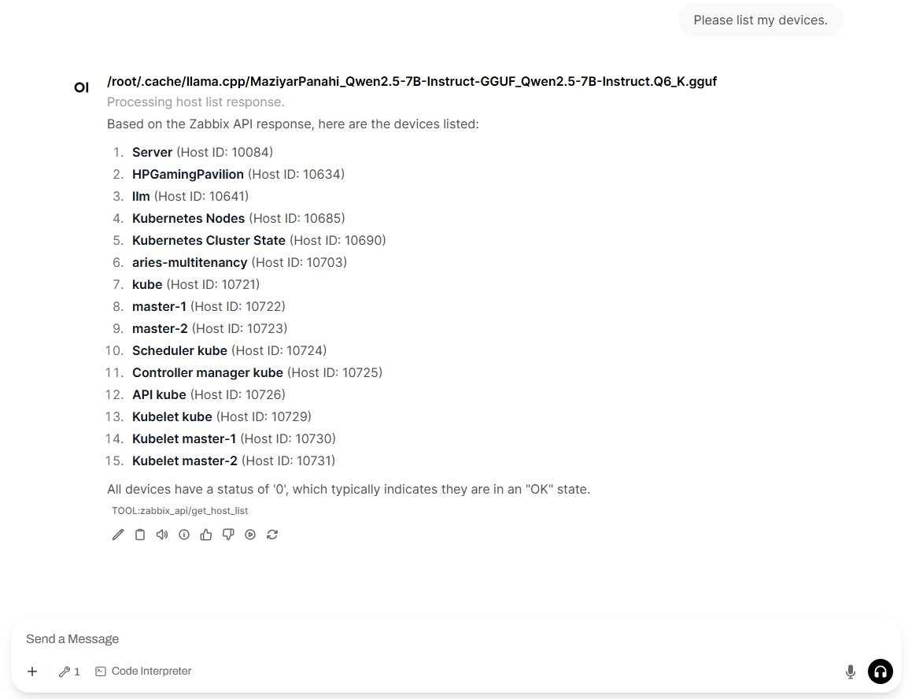

# Zabbix API

_This tool lets the LLM interact with the Zabbix server, which is used for centralized device monitoring._

## OpenWebUI tool

Was developed and tested on **OpenWebui v0.6.x** and Zabbix server v7.0.8

### Setup

1. Go to https://openwebui.com/t/ta5946/zabbix_api and import the tool to your Open WebUI instance (enter the correct URL)
2. Under Workspace > Tools > Zabbix API, set the ⚙️ Valves: 
   - Zabbix Api Url like `http://your_zabbix_server/zabbix/api_jsonrpc.php`*
   - Zabbix Api Token*
   - Max Response Length (optional)*
  
3. Save changes and open a New Chat
4. Click on ➕️ More and turn on 🔧 Zabbix API
5. Ask a test question, such as: "Please list my devices."
6. The LLM answer should look something like:

## LangChain tool

TODO description
